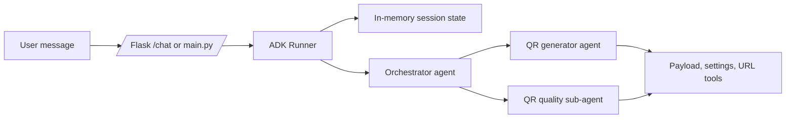

# QR Code Generator System

## Overview

The QR Code Generator System is a simple and efficient web application that allows users to generate QR codes for different types of information such as text, URLs, contact details, email addresses, phone numbers, Wi-Fi credentials, addresses, and payment information. The generated QR codes can be scanned using any smartphone or QR code scanner for quick and error-free access to information.

The project includes a Streamlit interface for quick local QR generation and a Flask API/static frontend for web and automation workflows.

---

## Problem Statement

In today's digital world, sharing information manually can be time-consuming and prone to errors. Users often need to share website links, contact details, Wi-Fi passwords, addresses, and payment information. Manually typing this information can lead to mistakes and inconvenience.

The QR Code Generator System solves this problem by converting user-provided information into QR codes that can be scanned instantly, making information sharing faster, easier, and more reliable.

---

## Objectives

* Generate QR codes instantly from user input.
* Support multiple data formats.
* Provide a simple and user-friendly interface.
* Allow users to download generated QR codes.
* Reduce manual data entry errors.
* Improve the efficiency of information sharing.

---

## Features

### Supported QR Code Types

* Text
* Website URLs
* Contact Information
* Phone Numbers
* Email Addresses
* SMS Messages
* Addresses
* Wi-Fi Credentials
* UPI Payment Information

### Additional Features

* Real-time QR code generation
* Download QR codes as PNG images
* Responsive and easy-to-use interface
* Fast processing and generation
* Error handling and input validation

---

## Technology Stack

### Frontend

* Streamlit
* HTML5, CSS3, JavaScript

### Backend

* Python
* Flask

### Libraries Used

* Streamlit
* Flask
* QRCode
* Pillow

---

## System Architecture

User Input
↓
Input Validation
↓
QR Code Generation
↓
QR Code Display
↓
Download QR Code

---

## Project Structure

`qr-code-generator-system/
│
├── .specify/
│   ├── specs/
│   │   └── qr-code-generator/
│   │       ├── requirements.md
│   │       ├── design.md
│   │       ├── tasks.md
│   │       └── acceptance-criteria.md
│   │
│   └── templates/
│       ├── requirements-template.md
│       ├── design-template.md
│       └── tasks-template.md
│
├── docs/
│   ├── CONTRIBUTING.md
│   ├── AGENTS.md
│   ├── USER_MANUAL.md
│   ├── INSTALLATION.md
│   ├── CHANGELOG.md
│   ├── ARCHITECTURE.md
│   └── API_DOCUMENTATION.md
│
├── src/
│   ├── frontend/
│   │   ├── index.html
│   │   │
│   │   ├── css/
│   │   │   ├── style.css
│   │   │   └── responsive.css
│   │   │
│   │   ├── js/
│   │   │   ├── app.js
│   │   │   ├── qrGenerator.js
│   │   │   └── validator.js
│   │   │
│   │   └── assets/
│   │       ├── images/
│   │       ├── icons/
│   │       └── screenshots/
│   │
│   └── backend/
│       ├── app.py
│       ├── config.py
│       │
│       ├── routes/
│       │   └── qr_routes.py
│       │
│       ├── services/
│       │   └── qr_generator.py
│       │
│       ├── utils/
│       │   ├── validator.py
│       │   └── file_handler.py
│       │
│       └── models/
│           └── qr_model.py
│
├── tests/
│   ├── test_qr_generator.py
│   ├── test_validation.py
│   ├── test_routes.py
│   └── test_api.py
│
├── assets/
│   ├── sample_qr_codes/
│   ├── diagrams/
│   └── project_images/
│
├── requirements.txt
├── LICENSE
├── README.md
├── .gitignore
├── Dockerfile
└── docker-compose.yml
---

## Installation

### ADK Prerequisites

* Python 3.11 or newer for Google ADK workflows.
* `GOOGLE_API_KEY` set in your environment or `.env` file.
* Optional `APP_NAME` value for session naming; defaults to `qr-code-generator`.

### Clone Repository

```bash
git clone https://github.com/your-username/qr-code-generator-system.git
cd qr-code-generator-system
```

### Create Virtual Environment

```bash
python -m venv venv
```

### Activate Virtual Environment

#### Windows

```bash
venv\Scripts\activate
```

#### Linux/macOS

```bash
source venv/bin/activate
```

### Install Dependencies

```bash
pip install -r requirements.txt
```

> The Streamlit UI uses Streamlit 1.54.0, which requires Python 3.10 or newer.

### Run the ADK Agent

```bash
cp .env.example .env
# edit .env and set GOOGLE_API_KEY
python main.py "Create a QR code for https://example.com"
```

You can also launch the Google ADK web UI:

```bash
adk web
```

### ADK Architecture



### Run Streamlit Application

```bash
streamlit run app.py
```

The application will start at:

```text
http://localhost:8501
```

### Run Flask Application

```bash
python src/backend/app.py
```

The Flask application will start at:

```text
http://localhost:5000
```

---

## Usage

1. Open the application in your browser.
2. Select the type of QR code you want to generate.
3. Enter the required information.
4. Click the Generate QR Code button.
5. View the generated QR code.
6. Download the QR code as a PNG image if needed.

### Example

Input:

```text
https://www.google.com
```

Output:

A QR code containing the Google website URL.

---

## Functional Requirements

### User Requirements

* Enter data for QR code generation.
* Generate QR codes instantly.
* Download generated QR codes.
* Receive error messages for invalid input.

### System Requirements

* Validate user input.
* Generate accurate QR codes.
* Support multiple QR code formats.
* Provide downloadable QR images.

---

## Non-Functional Requirements

* Fast response time
* Reliability
* Scalability
* User-friendly interface
* Responsive design
* Maintainability

---

## Testing

### Unit Testing

* QR code generation testing
* Input validation testing
* Download functionality testing

### Integration Testing

* Streamlit application testing
* End-to-end QR code generation workflow

### User Acceptance Testing

* QR code generation verification
* QR code scanning verification
* Download verification

---

## Future Enhancements

* Dynamic QR Codes
* QR Code Analytics
* QR Code History Management
* Custom QR Colors
* Logo Embedding
* Bulk QR Code Generation
* User Authentication
* Cloud Storage Integration

---

## Expected Outcome

The system enables users to generate and download QR codes quickly and efficiently, reducing manual effort and improving the accuracy of information sharing.

---

## Contributors

* Akshitha Reddy
* Project Team Members

---

## License

This project is licensed under the MIT License.

---

## Acknowledgements

* Streamlit Framework
* Python QRCode Library
* Pillow Library
* Open Source Community
